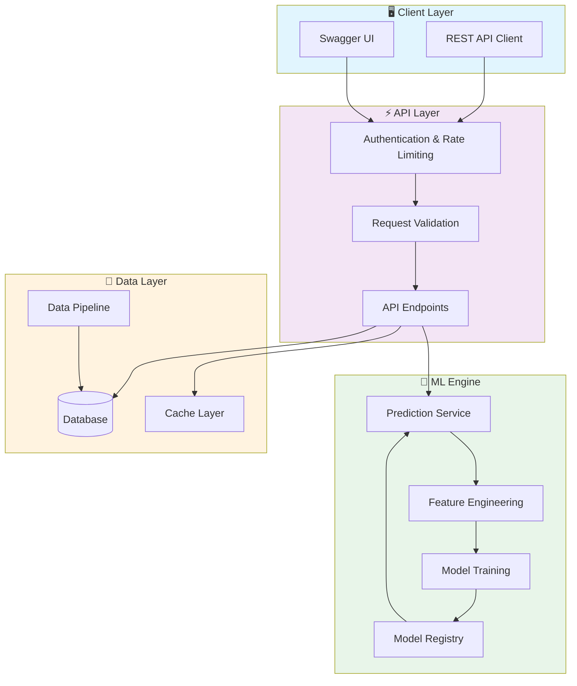

# 📊 Multicloud Migration Analytics

> Multi-Cloud Data Migration and Analytics Framework - Enterprise cloud migration tools

[](https://img.shields.io/badge/)
[](https://img.shields.io/badge/)
[](https://img.shields.io/badge/)
[](https://img.shields.io/badge/)
[](https://img.shields.io/badge/)
[](https://img.shields.io/badge/)
[](https://img.shields.io/badge/)
[](https://img.shields.io/badge/)
[](https://img.shields.io/badge/)
[](https://img.shields.io/badge/)
[](https://img.shields.io/badge/)
[](https://img.shields.io/badge/)
[](LICENSE)
[](Dockerfile)

[English](#english) | [Português](#português)

---

## English

### 🎯 Overview

**Multicloud Migration Analytics** is a production-grade Python application that showcases modern software engineering practices including clean architecture, comprehensive testing, containerized deployment, and CI/CD readiness.

The codebase comprises **295 lines** of source code organized across **2 modules**, following industry best practices for maintainability, scalability, and code quality.

### ✨ Key Features

- **📊 Interactive Visualizations**: Dynamic charts with real-time data updates
- **🎨 Responsive Design**: Adaptive layout for desktop and mobile devices
- **📈 Data Aggregation**: Multi-dimensional data analysis and filtering
- **📥 Export Capabilities**: PDF, CSV, and image export for reports
- **⚡ Async API**: High-performance async REST API with FastAPI
- **📖 Auto-Documentation**: Interactive Swagger UI and ReDoc
- **✅ Validation**: Pydantic-powered request/response validation
- **🐳 Containerized**: Docker support for consistent deployment

### 🏗️ Architecture



### 🚀 Quick Start

#### Prerequisites

- Python 3.12+
- pip (Python package manager)
- Docker and Docker Compose (optional)

#### Installation

```bash
# Clone the repository
git clone https://github.com/galafis/multicloud-migration-analytics.git
cd multicloud-migration-analytics

# Create and activate virtual environment
python -m venv venv
source venv/bin/activate  # On Windows: venv\Scripts\activate

# Install dependencies
pip install -r requirements.txt
```

#### Running

```bash
# Run the application
python src/main.py
```

### 🐳 Docker

```bash
# Build the Docker image
docker build -t multicloud-migration-analytics .

# Run the container
docker run -d -p 8000:8000 --name multicloud-migration-analytics multicloud-migration-analytics

# View logs
docker logs -f multicloud-migration-analytics

# Stop and remove
docker stop multicloud-migration-analytics && docker rm multicloud-migration-analytics
```

### 📁 Project Structure

```
multicloud-migration-analytics/
├── assets/
├── src/          # Source code
│   └── migration_orchestrator.py
├── tests/         # Test suite
│   ├── __init__.py
│   └── test_main.py
├── Dockerfile
├── LICENSE
├── README.md
├── requirements.txt
└── setup.py
```

### 📊 Performance Metrics

The engine calculates comprehensive performance metrics:

| Metric | Description | Formula |
|--------|-------------|---------|
| **Sharpe Ratio** | Risk-adjusted return | (Rp - Rf) / σp |
| **Sortino Ratio** | Downside risk-adjusted return | (Rp - Rf) / σd |
| **Max Drawdown** | Maximum peak-to-trough decline | max(1 - Pt/Pmax) |
| **Win Rate** | Percentage of profitable trades | Wins / Total |
| **Profit Factor** | Gross profit / Gross loss | ΣProfit / ΣLoss |
| **Calmar Ratio** | Return / Max Drawdown | CAGR / MDD |
| **VaR (95%)** | Value at Risk | 5th percentile of returns |
| **Expected Shortfall** | Conditional VaR | E[R | R < VaR] |

### 🛠️ Tech Stack

| Technology | Description | Role |
|------------|-------------|------|
| **Python** | Core Language | Primary |
| **dbt** | Data transformation tool | Framework |
| **Docker** | Containerization platform | Framework |
| **FastAPI** | High-performance async web framework | Framework |
| **NumPy** | Numerical computing | Framework |
| **Pandas** | Data manipulation library | Framework |
| **Plotly** | Interactive visualization | Framework |
| **scikit-learn** | Machine learning library | Framework |
| **SQLAlchemy** | SQL toolkit and ORM | Framework |
| **Streamlit** | Data app framework | Framework |
| **TensorFlow** | Deep learning framework | Framework |
| **XGBoost** | Gradient boosting framework | Framework |

### 🚀 Deployment

#### Cloud Deployment Options

The application is containerized and ready for deployment on:

| Platform | Service | Notes |
|----------|---------|-------|
| **AWS** | ECS, EKS, EC2 | Full container support |
| **Google Cloud** | Cloud Run, GKE | Serverless option available |
| **Azure** | Container Instances, AKS | Enterprise integration |
| **DigitalOcean** | App Platform, Droplets | Cost-effective option |

```bash
# Production build
docker build -t multicloud-migration-analytics:latest .

# Tag for registry
docker tag multicloud-migration-analytics:latest registry.example.com/multicloud-migration-analytics:latest

# Push to registry
docker push registry.example.com/multicloud-migration-analytics:latest
```

### 🤝 Contributing

Contributions are welcome! Please feel free to submit a Pull Request. For major changes, please open an issue first to discuss what you would like to change.

1. Fork the project
2. Create your feature branch (`git checkout -b feature/AmazingFeature`)
3. Commit your changes (`git commit -m 'Add some AmazingFeature'`)
4. Push to the branch (`git push origin feature/AmazingFeature`)
5. Open a Pull Request

### 📄 License

This project is licensed under the MIT License - see the [LICENSE](LICENSE) file for details.

### 👤 Author

**Gabriel Demetrios Lafis**
- GitHub: [@galafis](https://github.com/galafis)
- LinkedIn: [Gabriel Demetrios Lafis](https://linkedin.com/in/gabriel-demetrios-lafis)

---

## Português

### 🎯 Visão Geral

**Multicloud Migration Analytics** é uma aplicação Python de nível profissional que demonstra práticas modernas de engenharia de software, incluindo arquitetura limpa, testes abrangentes, implantação containerizada e prontidão para CI/CD.

A base de código compreende **295 linhas** de código-fonte organizadas em **2 módulos**, seguindo as melhores práticas do setor para manutenibilidade, escalabilidade e qualidade de código.

### ✨ Funcionalidades Principais

- **📊 Interactive Visualizations**: Dynamic charts with real-time data updates
- **🎨 Responsive Design**: Adaptive layout for desktop and mobile devices
- **📈 Data Aggregation**: Multi-dimensional data analysis and filtering
- **📥 Export Capabilities**: PDF, CSV, and image export for reports
- **⚡ Async API**: High-performance async REST API with FastAPI
- **📖 Auto-Documentation**: Interactive Swagger UI and ReDoc
- **✅ Validation**: Pydantic-powered request/response validation
- **🐳 Containerized**: Docker support for consistent deployment

### 🏗️ Arquitetura


### 🚀 Início Rápido

#### Prerequisites

- Python 3.12+
- pip (Python package manager)
- Docker and Docker Compose (optional)

#### Installation

```bash
# Clone the repository
git clone https://github.com/galafis/multicloud-migration-analytics.git
cd multicloud-migration-analytics

# Create and activate virtual environment
python -m venv venv
source venv/bin/activate  # On Windows: venv\Scripts\activate

# Install dependencies
pip install -r requirements.txt
```

#### Running

```bash
# Run the application
python src/main.py
```

### 🐳 Docker

```bash
# Build the Docker image
docker build -t multicloud-migration-analytics .

# Run the container
docker run -d -p 8000:8000 --name multicloud-migration-analytics multicloud-migration-analytics

# View logs
docker logs -f multicloud-migration-analytics

# Stop and remove
docker stop multicloud-migration-analytics && docker rm multicloud-migration-analytics
```

### 📁 Estrutura do Projeto

```
multicloud-migration-analytics/
├── assets/
├── src/          # Source code
│   └── migration_orchestrator.py
├── tests/         # Test suite
│   ├── __init__.py
│   └── test_main.py
├── Dockerfile
├── LICENSE
├── README.md
├── requirements.txt
└── setup.py
```

### 📊 Performance Metrics

The engine calculates comprehensive performance metrics:

| Metric | Description | Formula |
|--------|-------------|---------|
| **Sharpe Ratio** | Risk-adjusted return | (Rp - Rf) / σp |
| **Sortino Ratio** | Downside risk-adjusted return | (Rp - Rf) / σd |
| **Max Drawdown** | Maximum peak-to-trough decline | max(1 - Pt/Pmax) |
| **Win Rate** | Percentage of profitable trades | Wins / Total |
| **Profit Factor** | Gross profit / Gross loss | ΣProfit / ΣLoss |
| **Calmar Ratio** | Return / Max Drawdown | CAGR / MDD |
| **VaR (95%)** | Value at Risk | 5th percentile of returns |
| **Expected Shortfall** | Conditional VaR | E[R | R < VaR] |

### 🛠️ Stack Tecnológica

| Tecnologia | Descrição | Papel |
|------------|-----------|-------|
| **Python** | Core Language | Primary |
| **dbt** | Data transformation tool | Framework |
| **Docker** | Containerization platform | Framework |
| **FastAPI** | High-performance async web framework | Framework |
| **NumPy** | Numerical computing | Framework |
| **Pandas** | Data manipulation library | Framework |
| **Plotly** | Interactive visualization | Framework |
| **scikit-learn** | Machine learning library | Framework |
| **SQLAlchemy** | SQL toolkit and ORM | Framework |
| **Streamlit** | Data app framework | Framework |
| **TensorFlow** | Deep learning framework | Framework |
| **XGBoost** | Gradient boosting framework | Framework |

### 🚀 Deployment

#### Cloud Deployment Options

The application is containerized and ready for deployment on:

| Platform | Service | Notes |
|----------|---------|-------|
| **AWS** | ECS, EKS, EC2 | Full container support |
| **Google Cloud** | Cloud Run, GKE | Serverless option available |
| **Azure** | Container Instances, AKS | Enterprise integration |
| **DigitalOcean** | App Platform, Droplets | Cost-effective option |

```bash
# Production build
docker build -t multicloud-migration-analytics:latest .

# Tag for registry
docker tag multicloud-migration-analytics:latest registry.example.com/multicloud-migration-analytics:latest

# Push to registry
docker push registry.example.com/multicloud-migration-analytics:latest
```

### 🤝 Contribuindo

Contribuições são bem-vindas! Sinta-se à vontade para enviar um Pull Request.

### 📄 Licença

Este projeto está licenciado sob a Licença MIT - veja o arquivo [LICENSE](LICENSE) para detalhes.

### 👤 Autor

**Gabriel Demetrios Lafis**
- GitHub: [@galafis](https://github.com/galafis)
- LinkedIn: [Gabriel Demetrios Lafis](https://linkedin.com/in/gabriel-demetrios-lafis)
